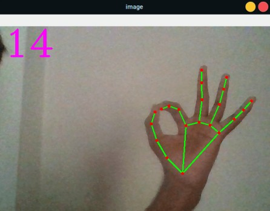

# HandTracking
Tracking hands and gestures using [mediapipe](https://mediapipe.dev/) and tensorflow lite.



## Usage (linux)
Clone the repository
```commandLine
$ git clone https://github.com/soumyadeepdutta/HandTracking
$ cd HandTracking
```

Create a virtual environment
```commandLine
$ pip install python3-virtualenv
$ virtualenv venv
$ source venv/bin/activate
```
Install dependencies
```commandLine
$ pip install -r requirements.txt
```
Run
```commandLine
$ python main.py
```
Press 'q' to exit.